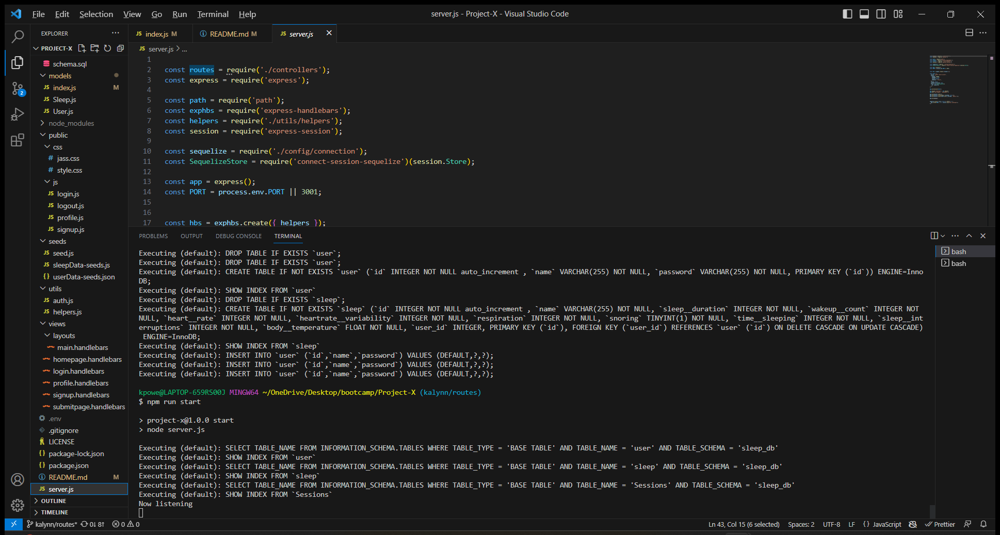

# Project-X
Project X

## User Story

AS A individual that struggles with sleep issues
I WANT to be able to input and track sleep data 
SO THAT I can keep track of my sleeping patterns

## Acceptance Criteria

GIVEN a sleep application
WHEN I open the Sleep Tracker
THEN I am presented with a landing page
WHEN I click signup
THEN I will be redirected to a signup page
WHEN I input my info
THEN I click submit
WHEN I click login
THEN I will be redirted to input my user data
WHEN I submit
THEN I will be redirected to all my user data and stats
WHEN I click logout
THEN I will be redirect to the homepage

## Description

A node.js application that takes in user input to store sleep data. When the Data is generated, it is saved and stored in a library. With the option to update as needed or delete for future use. 

## Installation

First git clone this repo: `https://github.com/kmarie0420/Project-X`
Then run npm i at the root of this project in your local directory.
`npm init`
   * Uses the [MySQL2](https://www.npmjs.com/package/mysql2) 
   * Uses the [Sequelize](https://www.npmjs.com/package/sequelize)
   * Uses the [dotenv](https://www.npmjs.com/package/dotenv)
   * Uses the [Express](https://www.npmjs.com/package/express)
   * Uses the [bcrypt](https://www.npmjs.com/package/bcrypt)
   * Uses the [express-handlebars](https://www.npmjs.com/package/express-handlebars)
   * Uses the [server.js](https://www.npmjs.com/package/server.js)

## Usage Information

To run this application, use the command line to navigate to the directory of the application, install all dependencies (npm i), then source your database on mysql. Once its sourced, `exit` mysql. `npm run seed` also run `npm run start`. You will then get a prompt saying `API server now on port 3001.` Once you navigate to the port on your UI, you can either login in or sign up. Once logged in, you can input user data that will be stored in your local storage. With the ability to delete current data as well.

## Screenshots

.png>)

## Contributors

* Raheim Devins
* Kalynn Powell
* Mark Amaro
* Dylan Cummins

## License

## Github Repository

https://github.com/kmarie0420/Project-X 

## Walk-Through Video

## Questions

If you have any questions or concerns, please email:
   * Kalynn Powell - kpowell0420@gmail.com or [Github](https://github.com/kmarie0420) 
   * Dylan Cummins - dcummins4167@gmail.com or [Github](https://github.com/MarkAAmaro) 
   * Mark Amaro - manthonyamaro@yahoo.com or [Github](https://github.com/DylanCummins4167) 
   * Raheim Devins - Raheimdev2011@gmail.com or [Github](https://gitHub.com/RaheimDevins) 

## Credits

https://www.npmjs.com/package/mysql2
https://www.npmjs.com/package/sequelize
https://www.npmjs.com/package/dotenv
https://www.npmjs.com/package/express
https://www.npmjs.com/package/bcrypt
https://www.npmjs.com/package/express-handlebars 
https://www.npmjs.com/package/server.js
https://gist.github.com/lukas-h/2a5d00690736b4c3a7ba 
https://devcenter.heroku.com/categories/reference 
https://stackoverflow.com/questions/62169412/express-routes-stopped-working-after-setting-app-in-production-on-heroku
https://stackoverflow.com/questions/38757728/using-an-enviroment-variable-for-local-sequelize-configuration
https://www.javascripttutorial.net/javascript-dom/javascript-form-validation/
https://stackoverflow.com/questions/19341975/heroku-node-cannot-find-module-error 
https://devcenter.heroku.com/articles/jawsdb#server-metrics